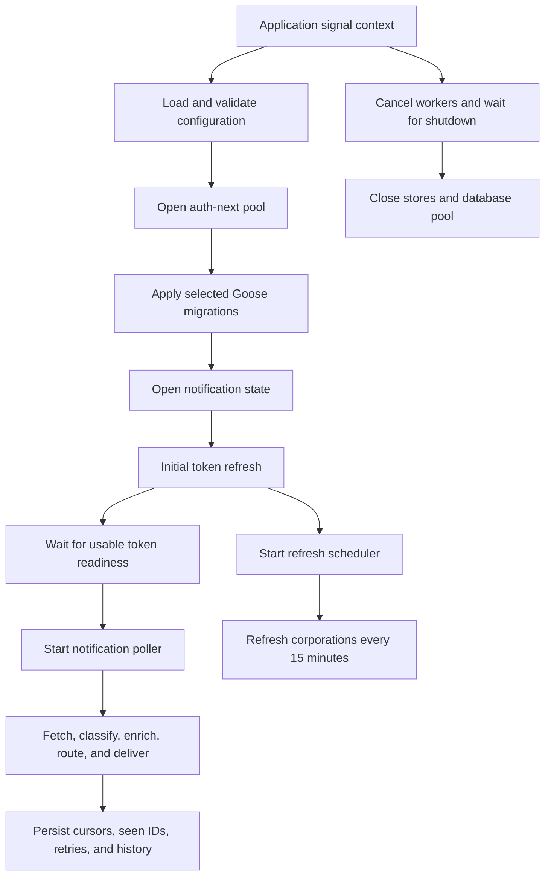

# Rex Development Guide

This document is for maintainers and contributors. The user-facing setup and
alert configuration guide is in [README.md](README.md).

## Repository Shape

Rex contains two Go modules:

| Path | Module | Role |
| --- | --- | --- |
| `/` | `github.com/btnmasher/rex` | Service, integrations, alerting, and commands. |
| `lib/jobruntime` | `github.com/btnmasher/rex/jobruntime` | Reusable generic job runner and stores. |

Important package ownership:

- `cmd/rex` is the composition root. It owns process signals, startup, migration and debug modes, worker lifecycle, and shutdown ordering.
- `internal/authnextdb` owns SQLC access to auth-next-owned PostgreSQL projections.
- `internal/tokenexport` owns the auth-next token export HTTP boundary.
- `internal/token` owns the in-memory corporation token pool and token rotation. It does not query databases or persist tokens.
- `internal/esi` owns ESI transport, typed endpoints, request middleware, ETags, rate limits, and bounded upstream retries.
- `internal/universe` owns memory-cache-first entity and location resolution with optional database and public ESI sources.
- `internal/notifications` owns ESI notification parsing, metadata extraction, classification, canonical alert paths, and safe text handling.
- `internal/alerts` owns enrichment orchestration, destination routing, Discord message rendering, and history recording.
- `internal/discord` owns the provider-neutral message model and Discord webhook transport.
- `internal/notificationstate` owns cursor, deduplication, pending delivery, and alert-history contracts.
- `internal/poller` owns corporation scheduling, cursor advancement, global notification deduplication, and bounded delivery retry coordination.

The `gen/` directories contain SQLC output. Change the owning schema, query, or
SQLC configuration file and regenerate with `task generate`; never edit generated
files directly.

## Runtime Flow



The application runs as one process. Startup creates required dependencies
before workers begin. Runtime workers derive from the application context and
are joined before shared resources close. Startup migrations use a
cancellation-independent context so an in-progress migration can finish its
transaction before shutdown proceeds.

## Notification Processing

The poller evaluates corporations every minute. Empty token pools are not
queued. Token pools with ten or more usable identities may poll each cycle;
smaller pools receive smoothed cadence. Normal notification polling does not
reuse an identity within ten minutes.

For each character stream, the poller:

1. Selects a usable corporation token and fetches the notification list from ESI.
2. Ignores `is_read`; cursor state and the global notification-ID ledger are authoritative.
3. Sorts eligible rows by notification timestamp and applies the hard ten-minute lookbehind.
4. Marks stale rows and delivery candidates in durable state without advancing past unresolved failures.
5. Classifies known notification types into canonical dot-path alert leaves.
6. Resolves matching destinations, enriches the event, renders Discord payloads, and delivers them.
7. Records successful history and queues only failed destinations for bounded retry.

Notification IDs are globally deduplicated. A notification is claimed once,
even if it appears in multiple corporation streams. A pending delivery stores
the raw notification and failed destination IDs so a retry does not refetch the
original row; it reclassifies the stored payload before delivery.

The cursor rules are intentionally conservative:

- Existing streams never deliver a notification older than the ten-minute lookbehind.
- New streams use the same window rather than replaying the entire first ESI response.
- Future upstream timestamps are clamped to current UTC before cursor storage.
- Rows marked stale are considered handled and advance the character cursor.
- Cursor persistence or delivery failure stops processing before later rows can be skipped.

## Alert Taxonomy And Routing

Canonical alert definitions live in
[`internal/notifications/notifications.go`](internal/notifications/notifications.go).
Each supported ESI type maps to one leaf path and, where appropriate, one or
more parent groups. Configuration expands groups to leaves, then applies
destination-scoped leaf exclusions. Exclusions always win over inclusion.

Routing is evaluated in this order:

1. Match the polling corporation against the destination's corporation filter.
2. Match the classified leaf against the destination's compiled selectors.
3. Apply the destination's excluded leaf paths.
4. Apply excluded structure type IDs using payload type data first and enriched structure data second.
5. Expand each matching destination into webhook targets.
6. Flatten duplicate webhook URLs so one notification produces at most one delivery per URL.

The first matching target wins when the same URL appears in multiple matching
destinations. Its target ID is retained for retry and alert-history records.
Corporation filters use the polling corporation ID in `DeliveryRequest`, not a
payload owner corporation. An empty include list means all corporations; a
non-empty include list limits delivery to those IDs. Exclusions always win,
including when an ID appears in both lists.
Semantic embed colors are static in `internal/alerts`; destination configuration
does not control colors.

When adding or changing a leaf:

1. Add or update the ESI type mapping, display name, group membership, parser, and renderer behavior.
2. Add classifier and routing tests, including group inclusion and leaf exclusion.
3. Add a synthetic debug fixture in `cmd/rex/discord_debug.go`.
4. Update the selector matrix in [README.md](README.md) and the example destination file when configuration changes.
5. Run `task verify` and `task test:race`.

## Enrichment

`internal/universe` resolves entities through this cascade:

1. Process-lifetime memory cache.
2. Auth-next database projection, when a database is configured.
3. Public ESI universe lookup.

The resolver logs cache hits and misses at debug level. If an entity is absent
from local cache and the database, the ESI request is forced rather than sent
with an ETag that could produce an unusable `304 Not Modified`. ETags are used
only when a cached response body is available. Resolver failures are best
effort for alert rendering and must not discard an otherwise deliverable alert.

Structure lookup is keyed by globally unique structure ID and is never scoped
to the corporation that polled the notification. Structure records may be
enriched with system, region, planet, moon, and type data. The ESI payload's
owner corporation is authoritative; polling-corporation context is only a
fallback when owner data is absent.

## Persistence And Migrations

Notification state and generic job state are separate:

| Store | Tables | Migration owner |
| --- | --- | --- |
| Notification-state SQLite | Cursors, seen IDs, delivery retries, alert history. | Rex, `internal/notificationstate/sqlite`. |
| Job-store SQLite | Generic runs, work items, checkpoints, and retry groups. | `lib/jobruntime/jobstore/sqlite`. |
| Job-store PostgreSQL | The same generic job tables for durable production jobs. | `lib/jobruntime/jobstore/postgres`. |
| Auth-next PostgreSQL | Corporation, token, universe, and structure projections. | Auth-next, never Rex. |

Rex uses embedded Goose migrations and the `goose_db_version` table. Each
database has one initial migration stream owned by its package. PostgreSQL job
migrations are applied automatically when `JOB_STORE=postgres`; SQLite job
migrations are not run against PostgreSQL, and auth-next tables are never
migrated.

Store constructors apply migrations automatically. The explicit commands use
the same application migration code:

```bash
task migrate:jobstore
task migrate:jobstore:sqlite
task migrate:jobstore:postgres
```

The explicit PostgreSQL task selects the backend by task name and requires
`DATABASE_URL` from the environment or root `.env`; it does not require
`JOB_STORE=postgres`. The `JOB_STORE` setting only controls which job-store
backend the running service constructs and therefore which automatic job-store
migrations it applies.

Migration work must complete atomically before workers start. A migration
failure is fatal. If schema changes require SQLC output, update the source SQL,
run `task generate`, inspect generated changes, then run `task verify`.

## Delivery And Recovery

Discord delivery is bounded and context-aware. Discord `429` responses use the
reported retry delay, with a 30-minute safety cap. Other transient upstream
failures use bounded exponential retry. Retry records are durable and are
dropped after 30 minutes from first queue insertion because stale alerts are
not useful as real-time notifications.

Alert history is recorded only after Discord accepts a message and is retained
for 30 days. It contains the raw notification, classified event, and exact
Discord payload, but never webhook URLs or access tokens. History is pruned at
startup and after new insertions.

The generic job runtime isolates failures at two levels:

- A claimed-item panic is logged and converted into the normal bounded retry or final-failure path.
- A lifecycle panic is recovered, logged with type and stack, returned as an error, and best-effort marked as a failed run.

Recovery operations derive a bounded context from the caller context without
discarding context values. Nil stores, requests, views, and optional resolvers
must be checked before dereference. Every claimed item must reach retry or
terminal state before a batch completes.

## Concurrency Rules

Rex is deployed as a single instance. ESI rate-limit buckets and entity caches
are process-local. Do not add multi-instance assumptions to notification-state
deduplication or retry draining without introducing an explicit distributed
lease or shared coordination store.

Use context-aware waits for every timer, semaphore, network request, database
operation, and worker handoff. New goroutines must have a clear owner, a
shutdown signal, and a wait path. The application waits for both workers before
closing the database or stores.

Per-corporation token refreshes use keyed serialization. A canceled waiter must
release its registry reference, and an idle keyed lock must be removed so lock
state cannot grow without bound.

## Development Commands

Run from the repository root:

```bash
task setup
task generate
task verify
task ci:checks
task test:race
task build
task run:debug:race
task debug:discord
```

`task verify` regenerates SQLC clients, checks formatting, runs tests, runs
`go vet`, and runs `golangci-lint` in both modules. `task ci:checks` adds race
tests and fails if generation or formatting changes the checkout. `task ci`
also builds the Docker image. Use `task test:race` for concurrency-sensitive
changes. The Discord debug command sends synthetic events through the
configured routing file without connecting to PostgreSQL.

For focused jobruntime work:

```bash
go -C lib/jobruntime test ./...
go -C lib/jobruntime vet ./...
go -C lib/jobruntime test -race ./...
```

Generated clients are checked into the repository. Do not hand-edit files
under `gen/`.

## Docker And CI

The Dockerfile builds a CGO-free static service image as a non-root user.
Migration files are embedded in the binary and are not executed during image
build. A new image applies pending migrations at startup before workers begin.
The Compose configuration mounts `/data` for both SQLite stores, makes the
container root filesystem read-only, and grants write access only to that
volume. The destination configuration bind mount uses Docker's private SELinux
relabel option for Fedora hosts. The image accepts `VERSION`, `REVISION`, and
`CREATED` build arguments for OCI metadata.

The CI workflow runs `task ci:checks` and a cached Buildx build for pull
requests and pushes to `main`. The release workflow accepts Go-style `vX.Y.Z`
tags, runs the same gates, and publishes the exact tag plus `latest` to GHCR
using the workflow's built-in `GITHUB_TOKEN`. Release images target amd64 and
arm64 and include SBOM and provenance attestations. The release workflow is
the only workflow with `packages: write` permission.

## Security Checklist

- Keep `.env` and `alert-destinations.json` untracked.
- Never log auth-next bearer credentials, access tokens, or webhook URLs.
- Keep payload logging disabled unless actively troubleshooting.
- Keep SQLite state on persistent storage in deployments.
- Validate new external URLs and bound response, payload, and history sizes.
- Preserve secret redaction when adding structured log attributes or durable fields.
