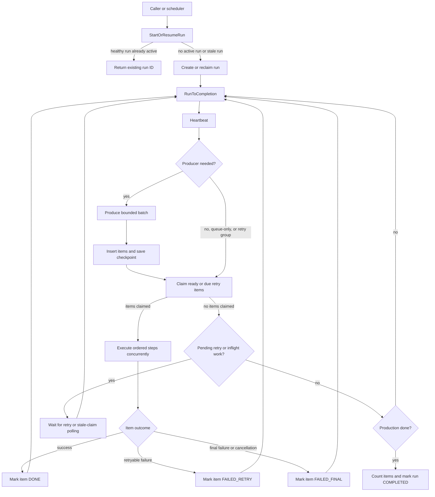

# jobruntime

`jobruntime` is a domain-neutral Go library for running reliable batches of
work. It separates the generic runtime from the application-specific code that
finds source rows, builds work items, and performs business operations.

This directory is a standalone Go module at
`github.com/btnmasher/rex/jobruntime`. Import packages from this module directly
with `go get github.com/btnmasher/rex/jobruntime`.

It has no HTTP, ESI, Discord, or Cloudflare dependency.

## The Short Version

A job run follows this loop:

1. The caller asks the runner to start or resume a run.
2. An optional producer returns a bounded batch of work items.
3. The runner claims ready items, so each item is owned by one worker at a time.
4. The runner executes the registered steps for each claimed item.
5. Each item is marked `DONE`, `FAILED_RETRY`, or `FAILED_FINAL`.
6. The runner waits for delayed retries or more produced work, then repeats.
7. The run is completed only when production is finished and no work remains.

The runner does not assume where work comes from or what processing an item
means. Those decisions belong to the job's optional producer, item type, codec,
and step delegates.

Panic resilience is part of the runner boundary. A panic from a claimed item
workflow is logged with its job/item context and converted into the normal
bounded retry path. A panic in production, claiming, persistence, or other run
lifecycle code is returned as an error and the run is best-effort marked
failed. Panic type and stack context are logged, but the panic value itself is
not persisted.

## End-To-End Flow



## What Makes Up A Job

Every concrete job supplies four things:

| Part | Responsibility | Owned by |
| --- | --- | --- |
| `Params` | Identifies the job, kind, trigger, and optional retry group | Caller |
| `Producer` | Optionally returns a bounded batch from any source | Domain package |
| `WorkItemCodec` | Converts store JSON into the domain item and encodes its result | Domain package |
| `StepDefinition` | Performs one ordered business operation on an item | Domain package |

The runner and store own lifecycle state. They do not own domain SQL or business
logic.

### A Minimal Producer-Backed Job

```go
type Invoice struct {
	jobs.ItemMeta
	CustomerID string `json:"customer_id"`
}

type InvoiceProducer struct {
	database InvoiceSource
}

func (i InvoiceProducer) Produce(
	ctx context.Context,
	request jobs.ProduceRequest,
) (jobs.ProduceResult, error) {
	checkpoint, err := decodeInvoiceCheckpoint(request.Checkpoint)
	if err != nil {
		return jobs.ProduceResult{}, err
	}
	rows, err := i.database.ListAfter(ctx, checkpoint, request.BatchSize)
	if err != nil {
		return jobs.ProduceResult{}, err
	}

	items := make([]jobstore.WorkItem, 0, len(rows))
	for _, row := range rows {
		items = append(items, jobstore.WorkItem{
			ItemID:      jobstore.ItemID(strconv.FormatInt(row.ID, 10)),
			PayloadJSON: row.PayloadJSON,
		})
	}
	return jobs.ProduceResult{
		Items:          items,
		NextCheckpoint: encodeInvoiceCheckpoint(lastRowID(rows, checkpoint)),
		Done:            len(rows) < request.BatchSize,
	}, nil
}
```

The real domain implementation will use its own SQLC client. The producer only
finds and serializes work. The runner inserts the returned items and persists
the returned checkpoint.

The store insertion operation is idempotent for an existing item ID with the
same payload. This matters when the process stops after insertion but before
the checkpoint update. A conflicting payload is rejected instead of silently
overwriting existing work.

Checkpoints are optional and opaque to the runtime. A producer can use a page
token, timestamp, offset, integer, or any other encoded position. The generic
`CheckpointCodec[C]` and `TypedProducer[C]` helpers allow domain code to use a
strongly typed checkpoint while the runner persists only bytes and a namespace:

```go
codec, err := jobs.NewJSONCheckpointCodec[InvoiceCheckpoint]("invoice-v1")
producer, err := jobs.NewTypedProducer(codec, produceInvoices)
```

Queue-only jobs do not need a producer or checkpoint. They enqueue work items
through the store before calling `RunOnce`. Retry-group runs also skip
production because their work items already exist.

The runner is then configured with an optional producer, codec, and ordered steps:

```go
runner, err := jobs.NewRunner(
	store,
	codec,
	jobs.WithProducer(producer),
	jobs.WithProduceBatchSize(1000),
	jobs.WithWorkerConcurrency(20),
	jobs.WithMaxAttempts(6),
	jobs.WithBackoff(2*time.Second, 2*time.Minute),
)
if err != nil {
	return err
}

if err := runner.RegisterSteps([]jobs.StepDefinition[Invoice]{
	{
		Name:     "validate",
		Delegate: validateInvoices,
	},
	{
		Name:     "send",
		Critical: true,
		Delegate: sendInvoices,
	},
}); err != nil {
	return err
}
```

A normal run without a producer is valid. It represents a queue-only job and
will process items that were enqueued by another part of the application.

## Run Lifecycle

### 1. Start Or Resume

`StartOrResumeRun` asks the store for one run of the requested `JobKind`.

| Store response | Runner behavior |
| --- | --- |
| A healthy run is already active | Return its run ID; do not start a second runner |
| No run is active | Create a `RUNNING` run and process it |
| A run is stale | Reclaim that run in place and process its existing checkpoint/items |

The PostgreSQL store enforces one active run per job kind with a partial unique
index. The memory store applies the same rule under its mutex.

If the run fails because of a runner or dependency error, it is marked
`FAILED`. A later retry-group operation can select failed items for another
run; starting a new ordinary run is not an automatic replay of a failed run.

### 2. Heartbeat

Each completion iteration updates the run activity timestamp. The heartbeat is
used to distinguish a live runner from a process that disappeared.

Heartbeat errors are logged, then the iteration continues. This avoids turning a
temporary diagnostics write failure into an immediate loss of the work loop,
but the store error remains visible to the caller through later operations.

### 3. Produce Work

If the job has a producer, it receives:

| Input | Meaning |
| --- | --- |
| `RunID` | The run receiving the work items |
| `Checkpoint` | The producer's last successfully persisted position |
| `BatchSize` | The maximum number of work items to return |

The producer owns source selection and serialization. It returns work items,
an optional next checkpoint, and whether production is exhausted. The runner
owns queue insertion and checkpoint persistence.

The checkpoint is opaque. Its namespace identifies the encoding, while its
value contains the serialized position. Checkpoint ordering is a producer
responsibility. The checkpoint and item insertion are separate store calls, so
insertion is deliberately idempotent to make a crash between those calls safe
to replay.

Queue-only and retry-group runs skip production because their work items already
exist.

### 4. Claim Work

`ClaimItems` atomically selects work and changes it to `INFLIGHT`.

| Item state | Claimable? | Meaning |
| --- | --- | --- |
| `READY` | Yes | Newly staged work |
| `FAILED_RETRY` with due retry time | Yes | Retryable failure ready again |
| `FAILED_RETRY` before retry time | No | Delayed retry |
| `INFLIGHT` before stale timeout | No | Another worker currently owns it |
| `INFLIGHT` after stale timeout | Yes | Previous worker is presumed gone |
| `DONE` | No | Successfully completed |
| `FAILED_FINAL` | No | Permanently failed until explicitly selected for retry |

The PostgreSQL implementation uses `FOR UPDATE SKIP LOCKED`, allowing multiple
workers to claim different items without waiting on one another. The memory
implementation performs the same transition while holding its mutex.

Each claim increments `AttemptCount`. Every terminal mutation includes the
attempt number, so a worker whose item was reclaimed cannot later overwrite the
new worker's result. This is the stale-claim fence.

### 5. Execute Steps

Claimed items are decoded into the domain type and processed concurrently up to
the configured worker limit. Steps run in registration order for each item.

Each step returns a `StepResult`:

| Result | Effect |
| --- | --- |
| `Succeeded` | Continue to the next step |
| `Retry` | Mark the item `FAILED_RETRY`, calculate a retry time, stop this item |
| `Failed` | Mark the item `FAILED_FINAL`, stop this item |
| `Canceled` | Mark the item `FAILED_FINAL` with a cancellation reason |

After the final step succeeds, the codec encodes the item result and the store
marks it `DONE`.

`Critical` and `AllowPartialFailure` determine whether a failed item also makes
the overall run fail. Item state is always persisted before the run-level result
is decided.

If a step delegate returns an error instead of a `StepResult`, the runner
returns a pipeline error. The item remains `INFLIGHT` and can be reclaimed after
the stale-item timeout. This is intentional: the runtime cannot safely guess
whether a delegate's side effect happened before it returned an error.

### 6. Retry And Drain

Normal item retries use bounded exponential backoff. The defaults are six total
attempts, a two-second base delay, and a two-minute maximum delay. A step may
provide an explicit retry time.

When a claim contains no immediately runnable items, the store reports whether
work is still pending and, for delayed retries, the earliest retry time. The
runner:

- waits until that retry time when one is known;
- waits one second when only inflight work remains;
- asks the producer for another batch when production is not finished; or
- completes the run when production is finished and no work remains.

This prevents a run from completing merely because its next retry is delayed.

### 7. Complete

The runner counts item states and marks the run `COMPLETED` only after:

1. the producer reports `Done`, or the job has no producer;
2. no item is claimable or pending; and
3. no delayed retry or active inflight item remains.

Run completion and item mutations require the run/item to still be in the
expected state. PostgreSQL affected-row counts are checked, so a lost race or
missing record is returned as an error instead of being reported as success.

## Failure And Recovery Matrix

| Failure or event | Behavior | Result |
| --- | --- | --- |
| Source or API query fails | Producer returns an error | Checkpoint is not advanced; run fails visibly |
| Crash after item insert | Next producer call repeats the batch | Matching items are accepted idempotently |
| Crash before item insert | Checkpoint is unchanged | The producer returns the batch again |
| Worker process disappears | Item remains `INFLIGHT` temporarily | Another worker reclaims it after 15 minutes |
| Old worker returns after reclaim | Attempt number no longer matches | Stale mutation is rejected |
| Step requests retry | Item becomes `FAILED_RETRY` | Runner waits and claims it later |
| Step permanently fails | Item becomes `FAILED_FINAL` | It is excluded until explicitly retried |
| Discord or other side effect returns ambiguous error | Item can be retried | Domain operations should be idempotent where possible |
| Runner process disappears | PostgreSQL run remains durable | Next invocation reclaims the stale run and checkpoint in place |
| Memory store process disappears | All memory state is lost | Use only for local or intentionally ephemeral jobs |
| Context is canceled | Current waits and I/O return cancellation | Run is not falsely marked complete |

The timeouts are intentionally conservative defaults: stale runs are reclaimed
after five minutes and stale item claims after fifteen minutes. A long-running
step must either finish within that window or use a future lease-renewal design;
otherwise a duplicate execution is possible after reclamation. Item attempt
fencing prevents stale workers from corrupting the newer attempt, but it cannot
undo an external side effect that already happened.

## Memory And PostgreSQL Stores

Both implementations satisfy `jobstore.Store` and are intended to have the
same lifecycle semantics.

| Store | Use | Durability | Concurrency model |
| --- | --- | --- | --- |
| `jobstore/memory` | Tests and intentionally ephemeral processes | Lost on process exit | One process mutex |
| `jobstore/sqlite` | Local durable single-process jobs | SQLite database file | One database connection, SQLite transactions |
| `jobstore/postgres` | Production durable jobs | PostgreSQL tables | SQL transactions, row locks, and `SKIP LOCKED` |

The PostgreSQL implementation keeps SQL in `queries.sql` and uses SQLC-generated
clients in `gen/`. Never edit generated files directly. Store constructors apply
the embedded Goose migrations for jobruntime tables only; they never migrate
caller-owned tables. PostgreSQL callers that need to apply migrations before
opening a store can call `jobstore/postgres.Migrate` directly.

## Retry Groups

Retry groups provide an operator-controlled replay path for selected failed
items:

1. Create a retry group from failed items in a source run.
2. The store tags those items with the retry-group ID and resets them to `READY`.
3. `RunRetryGroup` claims only those items and skips production.
4. The group becomes `DONE` only after its items finish.
5. A failed retry-group run is reopened so it can be attempted again.

## Public Package Boundaries

- `jobs`: generic runner, step execution, retry policy, and progress reporting.
- `jobstore`: lifecycle interface and shared runtime data types.
- `jobstore/memory`: process-local implementation.
- `jobstore/sqlite`: SQLC-backed single-process durable implementation using a CGO-free SQLite driver.
- `jobstore/postgres`: SQLC-backed durable implementation.

The runner depends only on `jobstore.Store` and the optional `Producer`. Domain
packages depend on runner interfaces, not on PostgreSQL implementation details.
This allows a job to use the memory store in tests and the PostgreSQL store in
production without changing its business logic.

## Verification

From the `jobruntime` module directory:

```bash
go test ./...
go vet ./...
go test -race ./...
```

The generated SQLC clients are committed with the module. When changing a
`schema.sql`, `queries.sql`, or SQLC configuration file, regenerate the affected
client with the repository's pinned SQLC version before running these checks.

For a consumer, the module can be verified without the Rex service or its
build tooling:

```bash
go test github.com/btnmasher/rex/jobruntime/...
```
